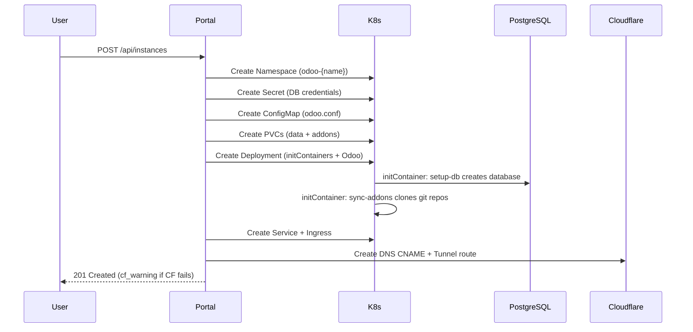

# High-Level Design — Aeisoftware K3s SaaS Platform

## 1. Overview

Aeisoftware operates a multi-tenant Odoo SaaS platform on a private OpenStack cloud. The platform enables automated provisioning, lifecycle management, and per-tenant isolation of Odoo ERP instances via a self-hosted management portal at **portal.aeisoftware.com**.

Each Odoo client receives:
- A dedicated Kubernetes namespace and deployment
- An isolated PostgreSQL database
- CephFS-backed persistent storage for data and addons
- A Cloudflare DNS route with MFA-protected access

---

## 2. Architecture Diagram

```
Internet
    │
    ▼
Cloudflare (DNS + Tunnel + Access MFA)
    │  *.aeisoftware.com
    ▼
┌──────────────────────────────────────────────────────┐
│   Cloudflare Tunnel Client (Docker on WSL)           │
│   cloudflared → web-proxy → K3s Traefik Ingress     │
└──────────────────────┬───────────────────────────────┘
                       │
                       ▼
┌──────────────────────────────────────────────────────┐
│   K3s HA Cluster (6 nodes, embedded etcd)            │
│                                                      │
│   ┌─────────┐  ┌─────────┐  ┌─────────┐            │
│   │ CP-1    │  │ CP-2    │  │ CP-3    │ Control     │
│   │ .28     │  │ .161    │  │ .205    │ Planes      │
│   └─────────┘  └─────────┘  └─────────┘            │
│   ┌─────────┐  ┌─────────┐  ┌─────────┐            │
│   │Worker-1 │  │Worker-2 │  │Worker-3 │ Agents      │
│   └─────────┘  └─────────┘  └─────────┘            │
│                                                      │
│   Workloads:                                         │
│   ┌──────────────────────────────────────┐          │
│   │  portal-system/saas-portal (2 pods)  │──────┐   │
│   └──────────────────────────────────────┘      │   │
│   ┌──────────┐ ┌──────────┐ ┌──────────┐       │   │
│   │ odoo-c1  │ │ odoo-c2  │ │ odoo-c3  │ ...   │   │
│   │ Odoo 17  │ │ Odoo 18  │ │ Odoo 19  │       │   │
│   └────┬─────┘ └────┬─────┘ └────┬─────┘       │   │
│        │             │            │              │   │
│        └─────────────┼────────────┘              │   │
│                      │ Kubernetes API            │   │
└──────────────────────┼───────────────────────────┘   │
                       │                               │
           ┌───────────┼───────────────────────────────┘
           │           │
           ▼           ▼
┌──────────────────────────────────────────────────────┐
│   Patroni PostgreSQL HA Cluster (3 nodes)            │
│                                                      │
│   PG-1 (Replica) ◄──► PG-2 (Replica) ◄──► PG-3     │
│   10.9.111.157        10.9.111.160        (Leader)   │
│                                            10.9.111. │
│   HAProxy VIP: 10.9.111.250:5432            100      │
│   etcd DCS: 10.9.111.{157,160,100}:2379             │
└──────────────────────────────────────────────────────┘
           │
           ▼
┌──────────────────────────────────────────────────────┐
│   Ceph Distributed Storage (2 nodes)                 │
│                                                      │
│   stg-nfs-01 (10.40.1.240) — MON / MDS / RGW        │
│   stg-nfs-02 (10.40.1.241) — MON / MDS / RGW        │
│                                                      │
│   ├── ceph-rbd   → ReadWriteOnce (Odoo data/fstore) │
│   ├── ceph-cephfs → ReadWriteMany (shared addons)   │
│   └── RGW (S3)  → DB templates (odoo-templates)     │
└──────────────────────────────────────────────────────┘
```

---

## 3. Components

### 3.1 K3s Kubernetes Cluster
- **Type:** HA cluster with embedded etcd
- **Distribution:** K3s (lightweight Kubernetes)
- **Nodes:** 3 control planes + 3 workers (6 total)
- **Ingress Controller:** Traefik (K3s bundled, disabled for custom install)
- **RBAC:** Portal runs with `saas-portal-manager` ClusterRole

### 3.2 Patroni PostgreSQL HA
- **Version:** PostgreSQL 16.13
- **HA Manager:** Patroni with etcd3 as distributed configuration store
- **Topology:** 1 Leader + 2 streaming Replicas (synchronous)
- **Failover:** Automatic via Patroni (30s TTL, 10s loop_wait)
- **Access:** HAProxy VIP on `10.9.111.250:5432` with in-cluster K8s Service `patroni-db.kube-system.svc.cluster.local`

### 3.3 SaaS Portal
- **Framework:** FastAPI (Python 3.11+)
- **Image:** `ghcr.io/jpvargassoruco/aeisoftware/saas-portal:latest`
- **Replicas:** 2 (HA)
- **Auth:** API key (`X-API-Key` header) + Cloudflare Access MFA
- **CI/CD:** GitHub Actions auto-build on push to `k3s-saas` branch
- **Functions:** Create/delete/configure/restart Odoo instances, manage DB templates

### 3.4 Ceph Storage
- **Nodes:** 2 (stg-nfs-01, stg-nfs-02) running MON, MDS, RGW
- **CSI Driver:** ceph-csi (Helm charts for RBD and CephFS)
- **StorageClasses:**
  - `ceph-rbd` — ReadWriteOnce (default) for Odoo data
  - `ceph-cephfs` — ReadWriteMany for shared addons across workers
- **RGW (S3):** DB template storage (pg_dump backups)

### 3.5 Cloudflare
- **DNS:** `*.aeisoftware.com` → Cloudflare Tunnel
- **Tunnel:** cloudflared Docker container on WSL
- **Access:** MFA-protected portal access
- **API Integration:** Portal auto-creates/deletes DNS routes + tunnel configs per instance

---

## 4. Instance Provisioning Flow



---

## 5. Tenant Isolation Model

| Layer | Mechanism |
|:---|:---|
| **Network** | Separate K8s namespace per tenant |
| **Database** | Per-instance database name + `db_filter = ^{name}$` |
| **Storage** | Per-instance PVCs (CephFS for addons, RBD for data) |
| **Config** | Per-instance ConfigMap (`odoo.conf`) and Secret |
| **DNS** | Per-instance Cloudflare route (`{name}.aeisoftware.com`) |
| **Access** | Cloudflare Access MFA on portal; API key for automation |

---

## 6. Security Model

- **Portal Access:** Cloudflare Access (MFA) + API key authentication
- **Database Master Password:** Set per-instance via `admin_passwd` in `odoo.conf`
- **Database Manager:** `list_db = True` (protected by `admin_passwd`)
- **PostgreSQL Auth:** md5 password authentication from K3s subnet (pg_hba.conf)
- **Secrets Management:** K8s Secrets for all credentials
- **CI/CD:** GitHub Actions with GHCR credentials for container registry
- **SSH:** Key-based authentication only (`~/.ssh/id_rsa`)

---

## 7. Supported Odoo Versions

| Version | Image | Status |
|:---|:---|:---|
| 17 | `odoo:17` | LTS |
| 18 | `odoo:18` | Current |
| 19 | `odoo:19` | Latest |
